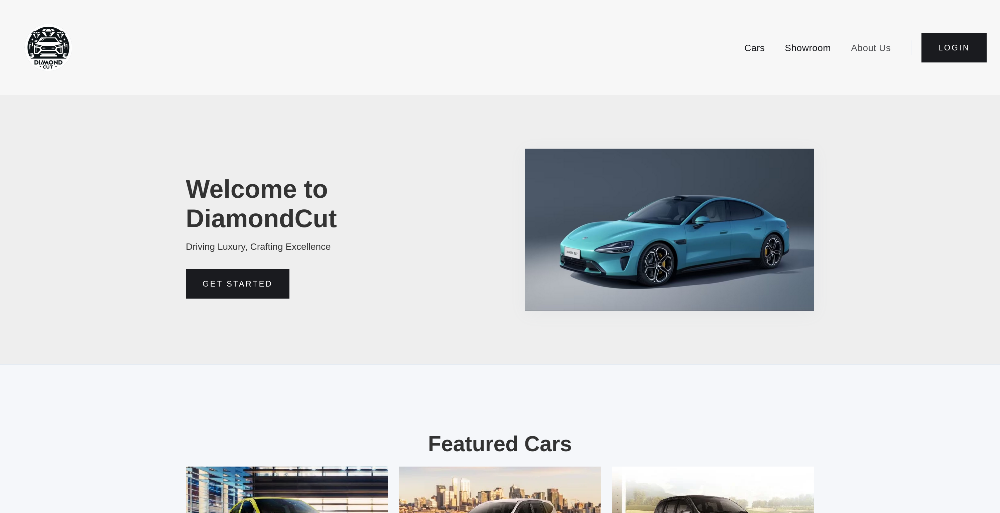
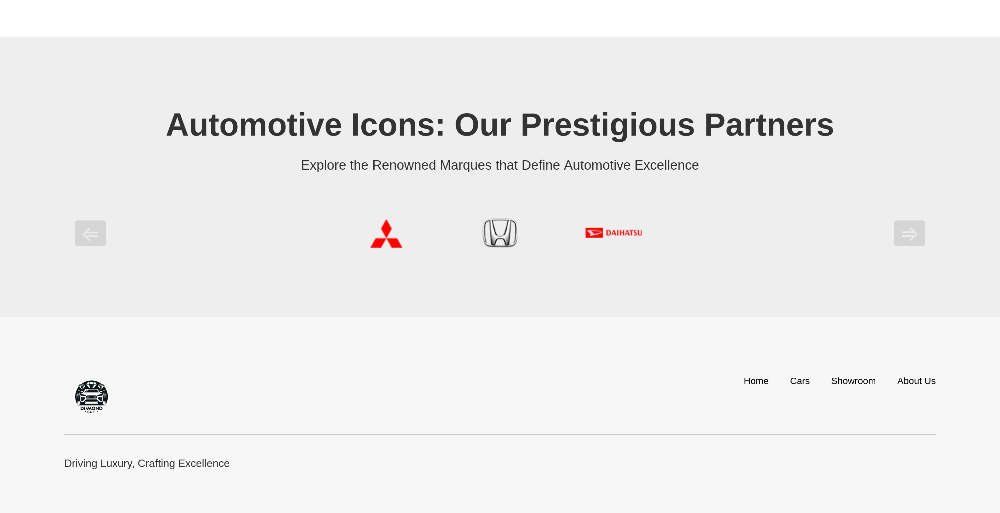
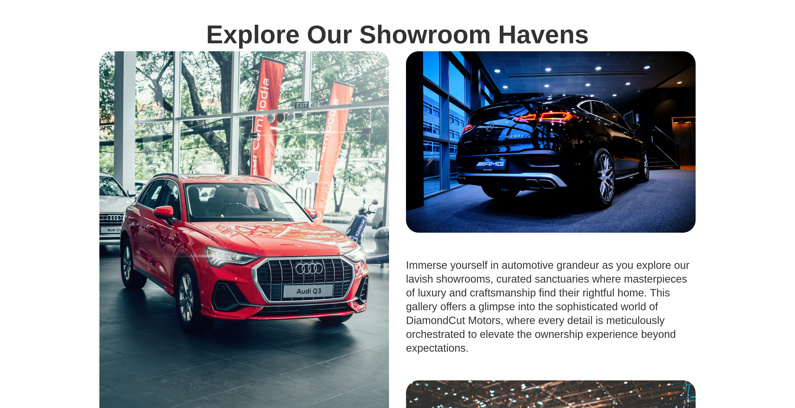
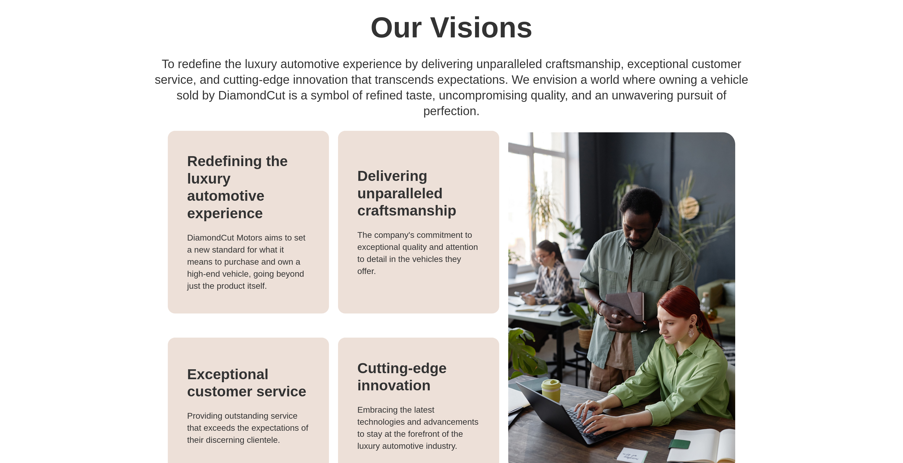

# DiamondCut

**Driving Luxury, Crafting Excellence**

DiamondCut is an imaginary luxury car dealership website showcasing both brand-new and pre-owned vehicles. This project was created as a learning exercise to develop skills in HTML, CSS, and JavaScript.



## Project Overview

This website features a modern, responsive design for a fictional car company that specializes in selling new and used cars. The site includes multiple pages with interactive elements, image galleries, and a clean user interface.

## Features

- **Responsive Design**: Mobile-friendly layout that adapts to different screen sizes
- **Multiple Pages**:
  - Home page with featured cars and gallery
  - Cars listing page with tabs for new/used vehicles
  - Showroom page with image carousel
  - About Us page with team information
  - Login page
- **Interactive Elements**:
  - Image carousels for brand logos
  - Tabbed navigation for car listings
  - Responsive navigation menu
- **Car Brands**: Features vehicles from Toyota, Honda, Daihatsu, Mitsubishi, Wuling, Tesla, Suzuki, and Renault

## Project Structure

```
Diamondcut/
├── html/           # HTML pages
│   ├── home.html
│   ├── cars.html
│   ├── showroom.html
│   ├── about-us.html
│   └── login.html
├── css/            # Stylesheets
│   ├── base.css
│   ├── home.css
│   ├── cars.css
│   ├── showroom.css
│   ├── about-us.css
│   └── login.css
├── js/             # JavaScript files
│   ├── home.js
│   ├── cars.js
│   ├── showroom.js
│   ├── about-us.js
│   └── login.js
└── image/          # Image assets
    ├── logo/
    ├── hero/
    ├── cars/
    ├── featured/
    ├── topcars/
    ├── showroom/
    └── about us/
```

## Getting Started

1. Clone the repository:
   ```bash
   git clone https://github.com/zanniko/Diamondcut.git
   ```

2. Navigate to the project directory:
   ```bash
   cd Diamondcut
   ```

3. Open `html/home.html` in your web browser to view the site locally

No build process or dependencies are required - this is a static website using vanilla HTML, CSS, and JavaScript.

## Technologies Used

- **HTML5**: Semantic markup and structure
- **CSS3**: Styling, layouts, and responsive design
- **JavaScript**: Interactive features and DOM manipulation

## Pages

### Home
The landing page features a hero section, featured cars showcase, and a gallery of top-tier vehicles.


### Cars
Browse through the complete inventory with separate tabs for new and used cars. Includes a carousel showcasing partner automotive brands.



### Showroom
View the physical showroom through an image gallery and carousel.



### About Us
Learn about the company and meet the team behind DiamondCut.



### Login
User authentication interface (UI only, no backend implementation).

## Learning Objectives

This project was built to practice:
- Semantic HTML structure
- CSS layout techniques (Flexbox, Grid)
- Responsive web design
- JavaScript DOM manipulation
- Interactive UI components
- Image optimization and responsive images
- File organization and project structure

## License

This project is licensed under the MIT License - see the [LICENSE](LICENSE) file for details.

## Acknowledgments

- Car images and brand logos used for educational purposes
- Stock photos from Everypixel
